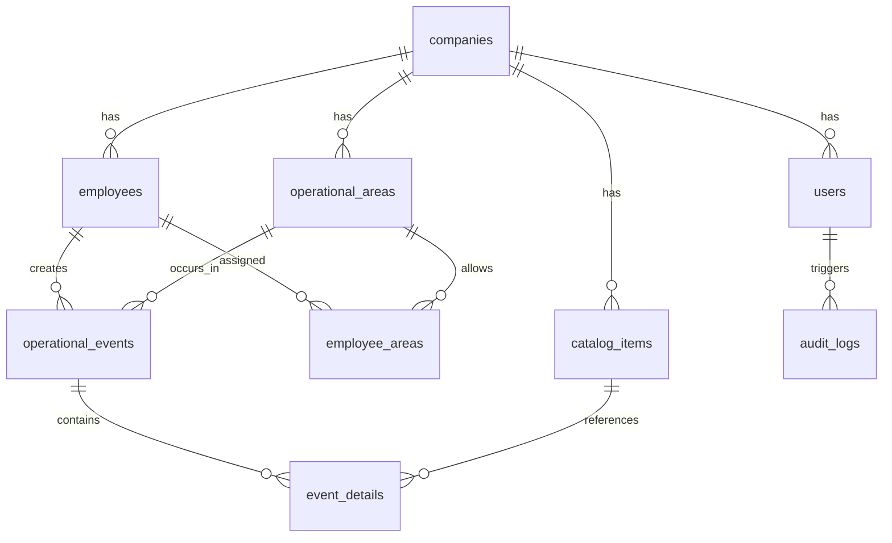

# Database Schema Design (Eloquent ORM)

> Based on "Migration-First" philosophy. PostgreSQL 16 + Eloquent ORM.
> **Principle**: The database is the immutable "Truth" of Frontier.

---

## Overview



---

## 1. Core Identity Module

### `companies` (Multi-Hotel Ready)
Future-proofing for multi-property deployment.

| Column | Type | Attributes | Description |
|--------|------|------------|-------------|
| `id` | UUID | PK, defaultRandom | Company ID |
| `name` | VARCHAR(100) | NotNull | "Hotel Paraíso" |
| `code` | VARCHAR(10) | Unique, NotNull | Short code "HP01" |
| `is_active` | BOOLEAN | default(true) | Soft delete |
| `created_at` | TIMESTAMP | defaultNow | Audit |
| `updated_at` | TIMESTAMP | defaultNow | Audit |

**Index**: `companies_code_idx` on `code`

---

### `users` (Management - JWT Auth)
Administrative access via Email/Password.

| Column | Type | Attributes | Description |
|--------|------|------------|-------------|
| `id` | UUID | PK, defaultRandom | Admin ID |
| `company_id` | UUID | FK → companies.id, NotNull | Tenant isolation |
| `email` | VARCHAR(255) | Unique, NotNull | Login email |
| `password_hash` | VARCHAR(255) | NotNull | Argon2id hash |
| `full_name` | VARCHAR(100) | NotNull | Display name |
| `role` | ENUM | `'OWNER'`, `'MANAGER'` | RBAC level |
| `is_active` | BOOLEAN | default(true) | Soft delete |
| `created_at` | TIMESTAMP | defaultNow | Audit |
| `updated_at` | TIMESTAMP | defaultNow | Audit |

**Index**: `users_email_idx` on `email`
**Index**: `users_company_idx` on `company_id`

---

### `employees` (Operational - PIN Auth)
Frontline workers with 4-digit PIN access.

| Column | Type | Attributes | Description |
|--------|------|------------|-------------|
| `id` | UUID | PK, defaultRandom | Employee ID |
| `company_id` | UUID | FK → companies.id, NotNull | Tenant isolation |
| `full_name` | VARCHAR(100) | NotNull | "María García" |
| `employee_code` | VARCHAR(20) | NotNull | Internal ID "EMP-001" |
| `access_pin_hash` | VARCHAR(255) | NotNull | Bcrypt hash (cost 10) |
| `is_active` | BOOLEAN | default(true) | Soft delete |
| `created_at` | TIMESTAMP | defaultNow | Audit |
| `updated_at` | TIMESTAMP | defaultNow | Audit |

**Index**: `employees_company_idx` on `company_id`
**Constraint**: Unique(`company_id`, `employee_code`)

> ⚠️ **Security**: PIN is NEVER stored plain. Use Bcrypt with cost 10.

---

## 2. Infrastructure Module

### `operational_areas` (The Map)
Physical or logical zones of operation.

| Column | Type | Attributes | Description |
|--------|------|------------|-------------|
| `id` | UUID | PK, defaultRandom | Area ID |
| `company_id` | UUID | FK → companies.id, NotNull | Tenant isolation |
| `name` | VARCHAR(100) | NotNull | "Lavandería", "Piso 2" |
| `type` | ENUM | `'SOURCE'`, `'PROCESSOR'` | Workflow role |
| `description` | TEXT | Nullable | Optional details |
| `is_active` | BOOLEAN | default(true) | Soft delete |
| `created_at` | TIMESTAMP | defaultNow | Audit |

**Index**: `areas_company_type_idx` on (`company_id`, `type`)

> **SOURCE** = Generates demand (Floors, Rooms)
> **PROCESSOR** = Fulfills demand (Laundry, Maintenance)

---

### `catalog_items` (The Assets)
Items tracked in operational flow.

| Column | Type | Attributes | Description |
|--------|------|------------|-------------|
| `id` | UUID | PK, defaultRandom | Item ID |
| `company_id` | UUID | FK → companies.id, NotNull | Tenant isolation |
| `name` | VARCHAR(100) | NotNull | "Toalla Grande" |
| `category` | VARCHAR(50) | NotNull | "Lencería", "Amenities" |
| `icon_ref` | VARCHAR(50) | NotNull | Icon key for UI |
| `unit` | VARCHAR(20) | default('piece') | "piece", "kg", "set" |
| `is_active` | BOOLEAN | default(true) | Soft delete |
| `created_at` | TIMESTAMP | defaultNow | Audit |

**Index**: `items_company_category_idx` on (`company_id`, `category`)

---

### `employee_areas` (N:M Assignment)
Which employees can operate in which areas.

| Column | Type | Attributes | Description |
|--------|------|------------|-------------|
| `id` | UUID | PK, defaultRandom | Relation ID |
| `employee_id` | UUID | FK → employees.id, NotNull | Employee |
| `area_id` | UUID | FK → operational_areas.id, NotNull | Allowed area |
| `assigned_at` | TIMESTAMP | defaultNow | When assigned |

**Constraint**: Unique(`employee_id`, `area_id`)
**Index**: `emp_areas_employee_idx` on `employee_id`

---

## 3. The Ledger (Immutable Truth)

> 🔒 **CRITICAL**: These tables are APPEND-ONLY. No UPDATE, no DELETE.

### `operational_events` (Flow Registry)
Every operational action is recorded here.

| Column | Type | Attributes | Description |
|--------|------|------------|-------------|
| `id` | UUID | PK, defaultRandom | Event ID |
| `company_id` | UUID | FK → companies.id, NotNull | Tenant isolation |
| `timestamp` | TIMESTAMP(3) | defaultNow, NotNull | Millisecond precision |
| `employee_id` | UUID | FK → employees.id, NotNull | Who performed |
| `area_id` | UUID | FK → operational_areas.id, NotNull | Where |
| `event_type` | ENUM | `'DEMAND'`, `'SUPPLY'`, `'CORRECTION'` | Action type |
| `session_id` | VARCHAR(100) | NotNull | Device session trace |
| `notes` | TEXT | Nullable | Optional context |

**Index**: `events_timestamp_idx` on `timestamp` (BRIN for time-series)
**Index**: `events_company_area_idx` on (`company_id`, `area_id`, `timestamp`)
**Index**: `events_employee_idx` on `employee_id`

> **Event Types:**
> - `DEMAND` = Item sent for processing (dirty laundry collected)
> - `SUPPLY` = Item processed (clean laundry returned)
> - `CORRECTION` = Manager-authorized adjustment

---

### `event_details` (Granularity)
Line items within each event.

| Column | Type | Attributes | Description |
|--------|------|------------|-------------|
| `id` | UUID | PK, defaultRandom | Detail ID |
| `event_id` | UUID | FK → operational_events.id, NotNull | Parent event |
| `item_id` | UUID | FK → catalog_items.id, NotNull | Which item |
| `quantity` | INTEGER | NotNull, check > 0 | How many |

**Index**: `details_event_idx` on `event_id`

---

## 4. Audit & Compliance

### `audit_logs` (Configuration Changes)
Tracks all administrative changes (separate from operational ledger).

| Column | Type | Attributes | Description |
|--------|------|------------|-------------|
| `id` | UUID | PK, defaultRandom | Log ID |
| `company_id` | UUID | FK → companies.id, NotNull | Tenant isolation |
| `user_id` | UUID | FK → users.id, NotNull | Who made change |
| `timestamp` | TIMESTAMP | defaultNow | When |
| `action` | ENUM | See below | What action |
| `entity_type` | VARCHAR(50) | NotNull | "employee", "area", etc. |
| `entity_id` | UUID | NotNull | Affected record ID |
| `old_values` | JSONB | Nullable | Before state |
| `new_values` | JSONB | Nullable | After state |
| `ip_address` | VARCHAR(45) | Nullable | Client IP |

**Actions Enum**: `'CREATE'`, `'UPDATE'`, `'DELETE'`, `'RESTORE'`, `'PIN_RESET'`

**Index**: `audit_company_timestamp_idx` on (`company_id`, `timestamp`)

---

## 5. Session Management

### `employee_sessions` (PIN Sessions)
Tracks active operational sessions.

| Column | Type | Attributes | Description |
|--------|------|------------|-------------|
| `id` | UUID | PK, defaultRandom | Session ID |
| `employee_id` | UUID | FK → employees.id, NotNull | Session owner |
| `token_hash` | VARCHAR(255) | NotNull | Hashed session token |
| `device_fingerprint` | VARCHAR(255) | Nullable | Device binding |
| `created_at` | TIMESTAMP | defaultNow | Session start |
| `expires_at` | TIMESTAMP | NotNull | Auto-expire (12h) |
| `last_activity` | TIMESTAMP | defaultNow | Idle tracking |
| `is_active` | BOOLEAN | default(true) | Manual revoke |

**Index**: `sessions_employee_idx` on `employee_id`
**Index**: `sessions_expires_idx` on `expires_at` (for cleanup jobs)

---

## 6. Indexes & Performance

### Composite Indexes (Dashboard Queries)

```sql
-- Bottleneck view: Demand vs Supply by area
CREATE INDEX idx_events_bottleneck 
ON operational_events(company_id, area_id, event_type, timestamp DESC);

-- Employee productivity
CREATE INDEX idx_events_employee_perf 
ON operational_events(company_id, employee_id, timestamp DESC);
```

### BRIN Index (Time-Series)

```sql
-- Efficient range scans on timestamp
CREATE INDEX idx_events_time_brin 
ON operational_events USING BRIN(timestamp);
```

---

## 7. Constraints Summary

| Table | Constraint | Purpose |
|-------|------------|---------|
| `users` | Unique(`email`) | No duplicate admins |
| `employees` | Unique(`company_id`, `employee_code`) | Unique within company |
| `employee_areas` | Unique(`employee_id`, `area_id`) | No duplicate assignments |
| `event_details` | Check(`quantity > 0`) | Positive quantities only |
| `operational_events` | No DELETE trigger | Immutability enforcement |

---

### 8. Migration Strategy

### Order of Execution
1. `companies` (no dependencies)
2. `users` (depends on companies)
3. `employees` (depends on companies)
4. `operational_areas` (depends on companies)
5. `catalog_items` (depends on companies)
6. `employee_areas` (depends on employees, areas)
7. `employee_sessions` (depends on employees)
8. `operational_events` (depends on employees, areas)
9. `event_details` (depends on events, items)
10. `audit_logs` (depends on users)

### Seed Data (Initial Setup)
```php
// DatabaseSeeder.php

// 1. Create default company
$company = Company::create(['name' => 'Hotel Demo', 'code' => 'DEMO']);

// 2. Create OWNER user
User::create([
    'company_id' => $company->id,
    'email' => 'admin@hotel.com',
    'role' => 'OWNER'
]);

// 3. Create default areas
$areas = [
    ['name' => 'Pisos', 'type' => 'SOURCE'],
    ['name' => 'Lavandería', 'type' => 'PROCESSOR']
];
foreach ($areas as $area) {
    OperationalArea::create($area + ['company_id' => $company->id]);
}

// 4. Create default catalog
$items = [
    ['name' => 'Toalla Grande', 'category' => 'Lencería', 'icon_ref' => 'towel-lg'],
    ['name' => 'Sábana King', 'category' => 'Lencería', 'icon_ref' => 'sheet-king'],
];
// ... insert items
```
