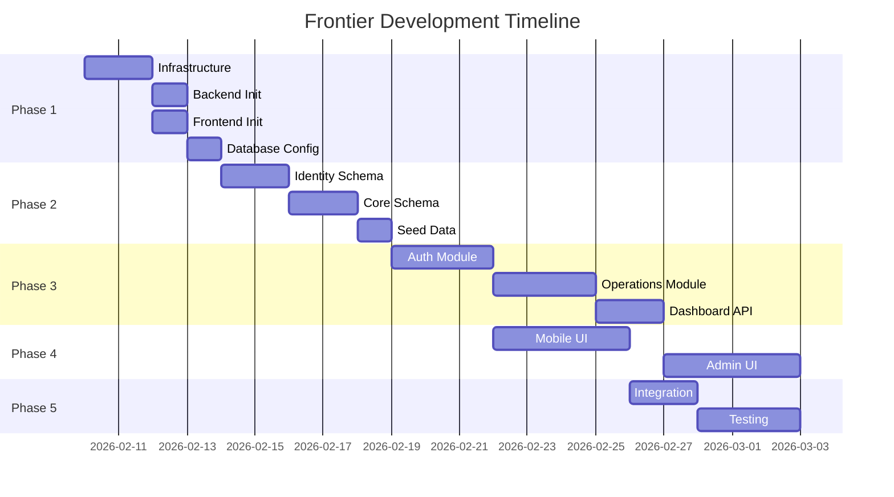
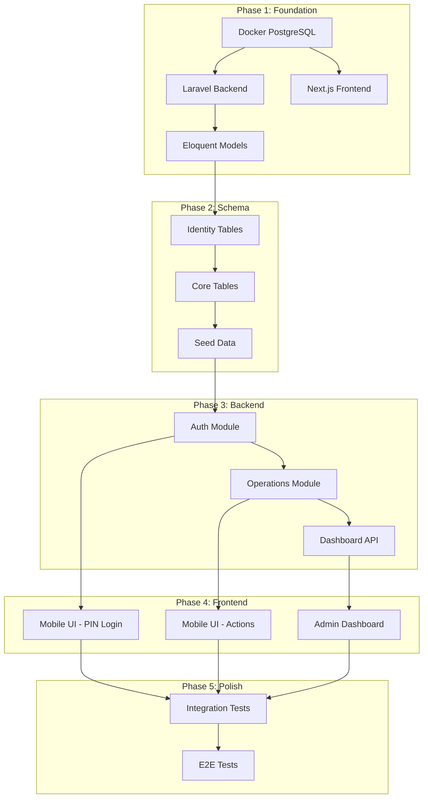

# Frontier Implementation Plan

> **Goal**: Build a dual-interface hotel operations system that captures the "invisible" operational reality.

---

## Overview



---

## Dependency Graph



---

## Phase 1: Infrastructure & Foundation

### 1.1 Docker Setup
| Attribute | Value |
|-----------|-------|
| **Size** | S (2-3 hours) |
| **Priority** | P0 |
| **Depends On** | None |

**Tasks:**
- [ ] Create `docker-compose.yml` with PostgreSQL 18
- [ ] Configure health checks
- [ ] Add pgAdmin for development

**Acceptance Criteria:**
```bash
docker compose up -d
# ✅ PostgreSQL accessible on localhost:5432
# ✅ Health check passes
```

---

### 1.2 Backend Init (Laravel)
| Attribute | Value |
|-----------|-------|
| **Size** | S (2-3 hours) |
| **Priority** | P0 |
| **Depends On** | 1.1 |

**Tasks:**
- [ ] Initialize Laravel 12 in `backend-laravel`
- [ ] Configure Form Request structure
- [ ] Setup Middleware (CORS, Sanitize, etc.)
- [ ] Add health endpoint

**Acceptance Criteria:**
```bash
php artisan serve
curl http://localhost:8000/up
# ✅ Returns { status: "UP" }
```

---

### 1.3 Frontend Init (Next.js)
| Attribute | Value |
|-----------|-------|
| **Size** | S (2-3 hours) |
| **Priority** | P0 |
| **Depends On** | 1.1 |

**Tasks:**
- [ ] Initialize Next.js 16 in `apps/frontend`
- [ ] Configure Tailwind CSS
- [ ] Install Shadcn/ui
- [ ] Setup TanStack Query

**Acceptance Criteria:**
```bash
npm run dev
# ✅ Page loads on localhost:3000
# ✅ Tailwind styles work
```

---

### 1.4 Database Connection
| Attribute | Value |
|-----------|-------|
| **Size** | S (1-2 hours) |
| **Priority** | P0 |
| **Depends On** | 1.2 |

**Tasks:**
- [ ] Configure `.env` database credentials
- [ ] Verify connection via Artisan
- [ ] Install pgsql extensions if needed

**Acceptance Criteria:**
```bash
# ✅ Migration status check successful
php artisan migrate:status
```

---

## Phase 2: Schema & "Truth"

### 2.1 Identity Schema
| Attribute | Value |
|-----------|-------|
| **Size** | M (4-5 hours) |
| **Priority** | P0 |
| **Depends On** | 1.4 |

**Tasks:**
- [ ] Create `companies` migration
- [ ] Create `users` migration (Admin)
- [ ] Create `employees` migration (PIN)
- [ ] Create `employee_sessions` migration
- [ ] Run migrations

**Acceptance Criteria:**
```bash
php artisan make:migration create_identity_tables
php artisan migrate
# ✅ Tables exist in PostgreSQL
```

---

### 2.2 Core Schema
| Attribute | Value |
|-----------|-------|
| **Size** | M (4-5 hours) |
| **Priority** | P0 |
| **Depends On** | 2.1 |

**Tasks:**
- [ ] Create `operational_areas` table
- [ ] Create `catalog_items` table
- [ ] Create `employee_areas` (N:M)
- [ ] Create `operational_events` table
- [ ] Create `event_details` table
- [ ] Create `audit_logs` table
- [ ] Add immutability trigger
- [ ] Create indexes

**Acceptance Criteria:**
```sql
-- ✅ Immutability works
UPDATE operational_events SET notes = 'test';
-- ERROR: Ledger is immutable
```

---

### 2.3 Seed Data
| Attribute | Value |
|-----------|-------|
| **Size** | S (2 hours) |
| **Priority** | P1 |
| **Depends On** | 2.2 |

**Tasks:**
- [ ] Create seed script
- [ ] Insert demo company
- [ ] Insert OWNER user
- [ ] Insert sample areas
- [ ] Insert sample items

**Acceptance Criteria:**
```bash
php artisan db:seed
# ✅ Admin can login with seeded credentials
```

---

## Phase 3: The "Brain" (Backend Core)

### 3.1 Auth Module
| Attribute | Value |
|-----------|-------|
| **Size** | L (8-10 hours) |
| **Priority** | P0 |
| **Depends On** | 2.3 |

**Tasks:**
- [ ] Implement admin login (JWT RS256)
- [ ] Implement token refresh
- [ ] Implement PIN login
- [ ] Implement PIN lockout (brute force)
- [ ] Create JWT guard
- [ ] Create Session guard
- [ ] Add rate limiting

**Acceptance Criteria:**
```bash
# Admin login
curl -X POST /auth/admin/login -d '{"email":"...", "password":"..."}'
# ✅ Returns JWT

# PIN login
curl -X POST /auth/pin/login -d '{"pin":"4829"}'
# ✅ Returns session token

# Brute force
# After 5 wrong PINs → ✅ Returns 423 Locked
```

---

### 3.2 Operations Module
| Attribute | Value |
|-----------|-------|
| **Size** | M (5-6 hours) |
| **Priority** | P0 |
| **Depends On** | 3.1 |

**Tasks:**
- [ ] Implement POST `/ops/events`
- [ ] Validate employee area access
- [ ] Atomic transaction for event + details
- [ ] Implement GET `/ops/events` (history)
- [ ] Implement GET `/ops/pending`
- [ ] Implement POST `/ops/corrections` (Manager)

**Acceptance Criteria:**
```bash
# Record event
curl -X POST /ops/events -H "x-session-token: ..." \
  -d '{"areaId":"...", "eventType":"DEMAND", "items":[...]}'
# ✅ Event created in ledger

# View pending
curl /ops/pending -H "x-session-token: ..."
# ✅ Returns aggregated pending count
```

---

### 3.3 Dashboard API
| Attribute | Value |
|-----------|-------|
| **Size** | M (5-6 hours) |
| **Priority** | P1 |
| **Depends On** | 3.2 |

**Tasks:**
- [ ] Implement GET `/dashboard/bottleneck`
- [ ] Implement GET `/dashboard/activities`
- [ ] Implement SSE `/dashboard/stream`
- [ ] Add employee stats endpoint
- [ ] Add area stats endpoint

**Acceptance Criteria:**
```bash
# Bottleneck
curl /dashboard/bottleneck -H "Authorization: Bearer ..."
# ✅ Returns demand vs supply metrics

# Real-time
curl /dashboard/stream?token=...
# ✅ Receives SSE events on new activity
```

---

## Phase 4: The Interfaces

### 4.1 Mobile UI ("The Hands")
| Attribute | Value |
|-----------|-------|
| **Size** | L (10-12 hours) |
| **Priority** | P0 |
| **Depends On** | 3.1 |

**Tasks:**
- [ ] Create mobile layout (no sidebar)
- [ ] Build PIN keypad component
- [ ] Build "Welcome" screen with pending count
- [ ] Build item grid (60x60 touch targets)
- [ ] Build quantity selector (+/-)
- [ ] Build "Send" action button
- [ ] Add haptic feedback
- [ ] Add loading/success states

**Acceptance Criteria:**
```
Manual Test:
✅ PIN entry works on mobile device
✅ Buttons are easily tappable with thumb
✅ Feedback is immediate (vibrate/visual)
✅ Event submits and shows confirmation
```

---

### 4.2 Admin UI ("The Tower")
| Attribute | Value |
|-----------|-------|
| **Size** | L (12-15 hours) |
| **Priority** | P1 |
| **Depends On** | 3.3 |

**Tasks:**
- [ ] Create admin layout (Shadcn sidebar)
- [ ] Build login page
- [ ] Build dashboard with bottleneck view
- [ ] Build activity feed
- [ ] Build employee CRUD pages
- [ ] Build area CRUD pages
- [ ] Build item CRUD pages
- [ ] Add real-time updates (SSE)

**Acceptance Criteria:**
```
Manual Test:
✅ Dashboard shows live demand vs supply
✅ Can create new employee, PIN is displayed
✅ Activity feed updates in real-time
```

---

## Phase 5: Integration & Testing

### 5.1 Integration Tests
| Attribute | Value |
|-----------|-------|
| **Size** | M (6-8 hours) |
| **Priority** | P1 |
| **Depends On** | 4.1, 4.2 |

**Tasks:**
- [ ] Auth flow tests
- [ ] Event creation tests
- [ ] Correction flow tests
- [ ] Dashboard aggregation tests

---

### 5.2 E2E Tests
| Attribute | Value |
|-----------|-------|
| **Size** | M (6-8 hours) |
| **Priority** | P2 |
| **Depends On** | 5.1 |

**Tasks:**
- [ ] Playwright setup
- [ ] Full employee workflow test
- [ ] Full manager workflow test

---

## Done When

- [ ] ✅ Infrastructure runs locally via Docker
- [ ] ✅ "María" can log in with PIN and report "Dirty Sheets" (Mobile)
- [ ] ✅ "Manager" can see the count rise in real-time (Desktop)
- [ ] ✅ Database contains immutable log of the event
- [ ] ✅ Manager can create correction if count was wrong
- [ ] ✅ All CRUD operations work for config entities

---

## Size Legend

| Size | Hours | Complexity |
|------|-------|------------|
| S | 1-3 | Single task, minimal dependencies |
| M | 4-6 | Multiple tasks, some coordination |
| L | 8-15 | Complex, multiple components |
| XL | 16+ | Major feature, cross-cutting |

---

## Estimated Total

| Phase | Size | Hours |
|-------|------|-------|
| Phase 1 | S+S+S+S | ~8-10 |
| Phase 2 | M+M+S | ~10-12 |
| Phase 3 | L+M+M | ~18-22 |
| Phase 4 | L+L | ~22-27 |
| Phase 5 | M+M | ~12-16 |
| **Total** | | **~70-87 hours** |
